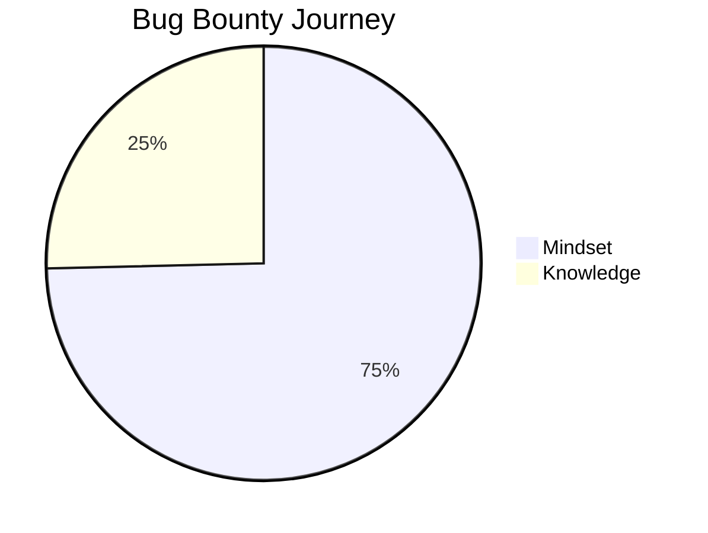
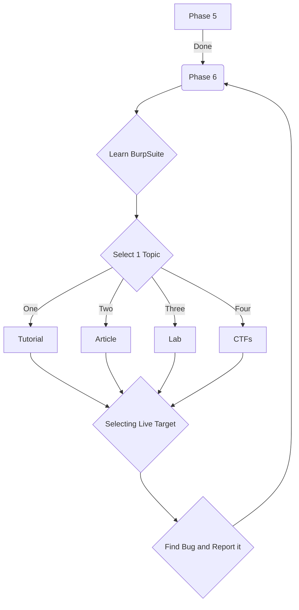

# Essence

# Phase 1: Python Basics

- Online Course: [CS50's Introduction to Programming with Python (edX)](https://www.edx.org/course/cs50s-introduction-to-programming-with-python "CS50's Introduction to Programming with Python (edX)")

- YouTube Playlist: [CS50 - Introduction to Programming with Python (YouTube)](https://youtube.com/playlist?list=PLhQjrBD2T3817j24-GogXmWqO5Q5vYy0V "CS50 - Introduction to Programming with Python (YouTube)")

- Timeline: 2-4 weeks

# Phase 2: Linux Basics

- <strong>Consider Switching to Linux</strong>

	- Get hands-on experience with Linux and its command-line utilities during the Linux Basics phase.

	- Experiment with basic Bash scripting to automate tasks and become more proficient in the Linux environment.

- YouTube Video: [Terminal Basics](https://youtu.be/iwolPf6kN-k "Terminal Basics")

- YouTube Playlist: [Bash Scripting Basics](https://youtube.com/playlist?list=PLBf0hzazHTGMJzHon4YXGscxUvsFpxrZT "Bash Scripting Basics")

- Timeline: 2-3 weeks

# Phase 3: Networking Basics

- YouTube Video: [Introduction to Networking Basics](https://youtu.be/IPvYjXCsTg8 "Introduction to Networking Basics")

- Timeline: 2-3 weeks

# Phase 4: Web Development Fundamentals

- YouTube Video: [Web Development Fundamentals](https://www.youtube.com/live/alnzFK-4xMY?feature=share "Web Development Fundamentals")

- Timeline: 2-3 weeks

# Phase 5: JSON and REST APIs

- YouTube Video (JSON):  [JSON](https://youtu.be/JuFdz8f-cT4 "JSON")

- Medium Article (JSON): [JSON](https://timothyrobards.medium.com/understanding-json-in-javascript-5098876d0915 "JSON")

- YouTube Playlist (REST APIs): [REST APIs](https://youtube.com/playlist?list=PLTCrU9sGybupzS5-3iYTsYUI1emBDKdHu "REST APIs") 

- Timeline: 1-2 weeks

# Phase 6: Understanding OWASP Top 10 Vulnerabilities

- Website Resource: [OWASP Top 10 Vulnerabilities](https://www.cloudflare.com/learning/security/threats/owasp-top-10/ "OWASP Top 10 Vulnerabilities") 

- Academic: [Web Security Academy](https://portswigger.net/web-security "Web Security Academy")

- Timeline: 1-2 weeks

# Phase 7: Practical Hands-on Learning (Lab and Live Targets)

- Practice in Lab and Playing CTFs:

	- Offline Labs:

		- [DWVA](https://github.com/digininja/DVWA "DWVA")
		- [bWAPP](http://www.itsecgames.com/ "bWAPP")
		- [W3Challs](https://w3challs.com/ "W3Challs")

	- Online Labs:

		- [PortSwigger Web Security Academy](https://portswigger.net/web-security "PortSwigger Web Security Academy")
		- [OWASP Juice Shop](https://owasp.org/www-project-webgoat/ "OWASP Juice Shop")

	- CTFs:

		- [Hacker 101](https://www.hacker101.com/ "Hacker 101")
		- [PicoCTF](https://picoctf.org/ "PicoCTF")
		- [VulnLab](https://www.vulnlab.com/ "VulnLab")
		- [HackThisSite](https://www.hackthissite.org/ "HackThisSite")

- Learn [BurpSuite](https://portswigger.net/burp "BurpSuite").

- Selecting live target and finding bug in it.

- Learning Bug Report Writing

# Phase 8: Specialization (Optional)

- Some potential areas of specialization include:

	- Mobile Application Security
	- IoT Security
	- Network Penetration Testing
	- Binary Exploitation
	- Cloud Security, etc.

# Resources:

### Blog and Articles:

- [BugCrowd Blog](https://www.bugcrowd.com/blog/ "BugCrowd Blog")
- [PortSwigger Blog](https://portswigger.net/blog "PortSwigger Blog")
- [YesWeHack Blog](https://blog.yeswehack.com/ "YesWeHack Blog")

### Writeups

- [Infosec](https://infosecwriteups.com/)
- [HackerOne Hacktivity](https://hackerone.com/hacktivity/overview "HackerOne Hacktivity")

### YouTube Channel:

- [Live Overflow](https://www.youtube.com/LiveOverflow)
- [Bug Bounty Reports Explained](https://www.youtube.com/BugBountyReportsExplained)
- [PWN function](https://www.youtube.com/PwnFunction)
- [Hacking Simplified](https://www.youtube.com/HackingSimplifiedAS)
- [Stok](https://www.youtube.com/STOKfredrik)
- [XSSRat](https://www.youtube.com/TheXSSrat)
- [Insider PHD](https://www.youtube.com/InsiderPhD)

### Bug Bounty Platform

- [BugCrowd](https://www.bugcrowd.com/ "BugCrowd")
- [HackerOne](https://www.hackerone.com "HackerOne")
- [Intigriti](https://www.intigriti.com/ "Intigriti")
- [YesWeHack (Europe)](https://www.yeswehack.com/ "YesWeHack (Europe)")
